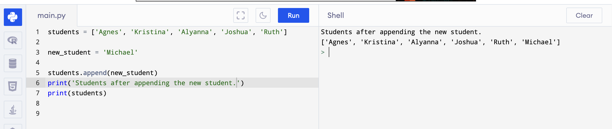
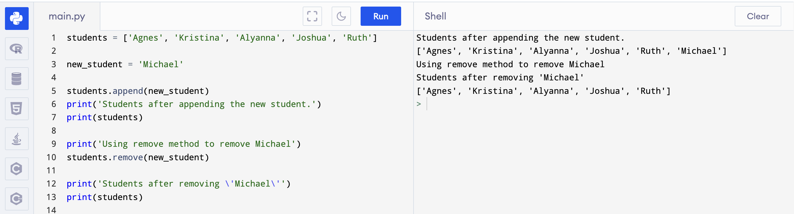
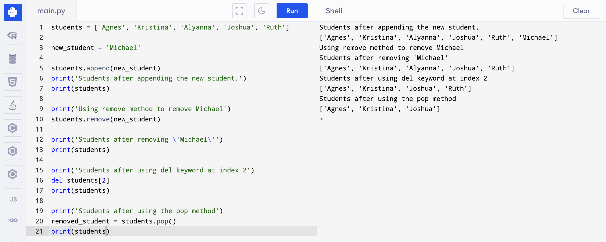

# Collection Types

In this course, we will explore two of the most common collection types, `List` amd `Tuple`.

<br/>

## List

In Python, a list is a built-in data structure that allows you to store and manipulate a collection of values. 
It is an ordered collection of items, where each item can be of different data types such as integers, floats, 
strings, or even other lists.

Here are some key features of lists in Python:

<br/>

## Creating and Accessing an Element from a List

Creating a list in python can be done in two ways, by using the angle brackets `[]` or by using the `list()` constructor. 
In this course, we will be commonlu deal with python using square brackets.

Let's say we'll create a list of students:

```py
students = ['Agnes', 'Kristina', 'Alyanna', 'Joshua', 'Ruth']
```

Elements in a list is numbered by indexes. For the above example, we have:

| Element    | Index |
| ---------- | ----- |
| 'Agnes'    | `0`   |
| 'Kristina' | `1`   |
| 'Alyanna'  | `2`   |
| 'Joshua'   | `3`   |
| 'Ruth'     | `4`   |

To access the elements in a list, we use the square bracket like this:

```py title="Accessing element in a list"
print(students[3])

# output: 'Joshua'
```

<br/>

## Adding Element to a List

We can add a data or element to a list using `append` method. On the previous article, I mentioned that everything in python 
are objects. Objects have methods[^1]. And list has a method called _append_. For example, if we want to add a name to the _students_ list, 
we do it like this:

```py title="Adding element to a list"
new_student = 'Michael'

students.append(new_student)

print(students)

# Output: ['Agnes', 'Kristina', 'Alyanna', 'Joshua', 'Ruth', 'Michael']
```

If we run it in the online compiler



<br/>

## Removing an Item from a List

There are several ways of removing an item or items from a list in python.

### 1. Using the `remove` method



Here we used the `remove` method of a list. This method removes the first occurence of the object we passed as parameter from the list

### 2. Using the `del` keyword

The del keyword can be used to remove an item from a list by its index. For example:

```py title="Removing item from a list using del keyword"
del students[2] # Removes the item at index 2 of the list
```

### 3. Using the `pop` method

The pop() method removes and returns the item at a specific index. If no index is specified, it removes and returns the last item in the list. For example:



Here we didn't specify the index so the pop method removed the last element.

I assigned the result of the pop method to a variable in the example, just for the sake of demonstrating
that it returns the object that was removed so you can use it for later.


[^1]: A function that belongs or is part of an object.