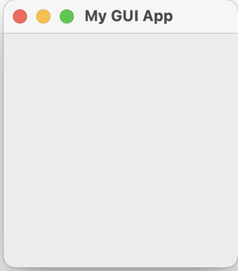

# Chapter 5: tkinter and Peak to OOP

In this chapter, we will introduce `tkinter`, the default GUI framework for python that is pre-installed in the distribution. For the next sub-chapter, in order to futher understand the usgaes of tkinter and other libraries, `OOP` or object oriented programming will be slightly introduced.

## tkinter

Tkinter is a Python binding to the Tk GUI toolkit. It is the standard Python interface to the Tk GUI toolkit, and is Python's de facto standard GUI. Tkinter is included with standard Linux, Microsoft Windows and macOS installs of Python.

To create a simple window in `tkinter`

```py
import tkinter as tk

root = tk.Tk()
root.title('My GUI App')
root.mainloop()
```

This will output a small window as shown below (the sample screenshot is taken from a macOS).



## OOP
