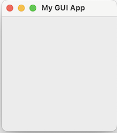
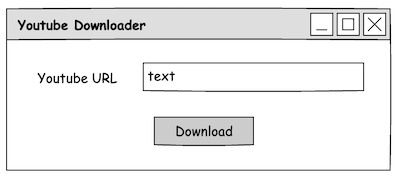

# Chapter 5: tkinter and Peak to OOP

In this chapter, we will introduce `tkinter`, the default GUI framework for python that is pre-installed in the distribution. For the next sub-chapter, in order to futher understand the usgaes of tkinter and other libraries, `OOP` or object oriented programming will be slightly introduced.

## tkinter

Tkinter is a Python binding to the Tk GUI toolkit. It is the standard Python interface to the Tk GUI toolkit, and is Python's de facto standard GUI. Tkinter is included with standard Linux, Microsoft Windows and macOS installs of Python.

### Example 1

To create a simple window in `tkinter`

_Listing 1.1.1_

```py
import tkinter as tk

root = tk.Tk()
root.title('My GUI App')
root.mainloop()
```

This will output a small window as shown below (the sample screenshot is taken from a macOS).



#### Listing 1.1.1 Explanation

On the above code, in line 1, we imported the tkinter library. But instead of just using `import tkinter`, we used `import tkinter as tk`.
by using `as tk`, we are just assigning the symbol `tkinter` to `tk` variable so that instead of calling `tkinter.Tk()`, we just use `tk.Tk()`.

On the next line on line 3, `root = tk.Tk()`, we are creating the main window for an application. We then assign this main window in the variable `root`,
you can create your own variable of course. `Tk()` is what we call a _constructor_ of a class and is called when instantiating an object.

Next is line 4, `root.title('My GUI App')`, this is setting the window title. You can also use the method `wm_title` like this

```py
root.wm_title('My GUI App')
```

The last line, `root.mainloop()` is what we keeps the tkinter application running and allows it to respond to user interactions.

The main difference between a commandline application and a GUI _(graphical user interface)_ application is that, in the commandline program,
the user interacts with it step by step. It cannot change the order unless the it is what is programmed to. In a GUI on the other hand, the user
interacts with the application with all the controls the he/she sees, not in a procedural way. This gives the user more control on using
the application.

### Example 2

In this next example, we will introduce you to a few widgets of tkinter and build something simple as shown below.



In this example, we are going to be using three (3) widgets of tkinter namely Label, Entry and Button. To create this:

_Listing 1.2.1_

```py
import tkinter as tk

root = tk.Tk()
root.title('Youtube Downloader')

# Define widgets
lbl_url = tk.Label(root, text='Youtube URL')
txt_url = tk.Entry(root, width=30)
btn_download = tk.Button(root, text='Download')

# Arrange widgets using geometry manager 'pack'
lbl_url.pack()
txt_url.pack()
btn_download.pack()

root.mainloop()
```

This will result to


#### Listing 1.2.1 Explanation

Now for the new parts.

On line 7 ot 9, we define the 3 widgets and put them in the variables `lbl_url`, `txt_url` and `btn_download`. In here, they are defined
by `tk.Label`, `tk.Entry` and `tk.Button` respectively as initialization. On the constructor, we have the first argument passed `root`.
This tells that our main window owns those widgets.

The named argument `text` for both the Label and the Button is for setting the text of those widgets and the `width` argument for Entry is for the number of characters. If the input characters exceeds this, the text will just be hidden in sight.

## OOP
