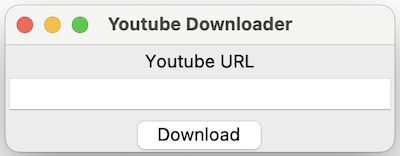

# Chapter 5: tkinter and Peek to OOP

In this chapter, we will introduce `tkinter`, the default GUI framework for python that is pre-installed in the distribution. For the next sub-chapter, in order to futher understand the usgaes of tkinter and other libraries, `OOP` or object oriented programming will be slightly introduced.

## tkinter

Tkinter is a Python binding to the Tk GUI toolkit. It is the standard Python interface to the Tk GUI toolkit, and is Python's de facto standard GUI. Tkinter is included with standard Linux, Microsoft Windows and macOS installs of Python.

### Example 1

To create a simple window in `tkinter`

_Listing 1.1.1_

```py
import tkinter as tk

root = tk.Tk()
root.title('My GUI App')
root.mainloop()
```

This will output a small window as shown below (the sample screenshot is taken from a macOS).


#### Listing 1.1.1 Explanation

On the above code, in line 1, we imported the tkinter library. But instead of just using `import tkinter`, we used `import tkinter as tk`.
by using `as tk`, we are just assigning the symbol `tkinter` to `tk` variable so that instead of calling `tkinter.Tk()`, we just use `tk.Tk()`.

On the next line on line 3, `root = tk.Tk()`, we are creating the main window for an application. We then assign this main window in the variable `root`,
you can create your own variable of course. `Tk()` is what we call a _constructor_ of a class and is called when instantiating an object.

Next is line 4, `root.title('My GUI App')`, this is setting the window title. You can also use the method `wm_title` like this

```py
root.wm_title('My GUI App')
```

The last line, `root.mainloop()` is what we keeps the tkinter application running and allows it to respond to user interactions.

The main difference between a commandline application and a GUI _(graphical user interface)_ application is that, in the commandline program,
the user interacts with it step by step. It cannot change the order unless the it is what is programmed to. In a GUI on the other hand, the user
interacts with the application with all the controls the he/she sees, not in a procedural way. This gives the user more control on using
the application.

### Example 2

In this next example, we will introduce you to a few widgets of tkinter and build something simple as shown below.


In this example, we are going to be using three (3) widgets of tkinter namely Label, Entry and Button. To create this:

_Listing 1.2.1_

```py
import tkinter as tk

root = tk.Tk()
root.title('Youtube Downloader')

# Define widgets
lbl_url = tk.Label(root, text='Youtube URL')
txt_url = tk.Entry(root, width=30)
btn_download = tk.Button(root, text='Download')

# Arrange widgets using geometry manager 'pack'
lbl_url.pack()
txt_url.pack()
btn_download.pack()

root.mainloop()
```

This will result to



#### Listing 1.2.1 Explanation

Now for the new parts.

On line 7 ot 9, we define the 3 widgets and put them in the variables `lbl_url`, `txt_url` and `btn_download`. In here, they are defined
by `tk.Label`, `tk.Entry` and `tk.Button` respectively as initialization. On the constructor, we have the first argument passed `root`.
This tells that our main window owns those widgets.

The named argument `text` for both the Label and the Button is for setting the text of those widgets and the `width` argument for Entry is for the number of characters. If the input characters exceeds this, the text will just be hidden in sight.

In tkinter, there are three geometry management: pack, place and grid. In the example above, we used `pack`. By default, the pack stacks the widgets vertically. We will not be discussing much of these in details in this course.

To add a functionality to our button, we can create a function and then bind it to the widget.

```py
def btn_clicked():
    print('The button is clicked')

btn_download = tk.Button(root, text='Download', command=btn_clicked)
```

In the above code, when the button is clicked, the program will call the btn_clicked function and do the actions inside it.

## OOP

In order to understand the basic usage of properties and methods of an object, which we have used so far, we will be having
a peek of object oriented programming.

Object-oriented programming (OOP) in Python and other languages is a way of organizing code into classes and objects.
Classes are blueprints for objects, and objects are instances of classes. OOP makes code more organized, readable, and maintainable.

An object can have properties and methods that we can use to control them.

Let's say for example, we want to have an object `rectangle`. And we want to specify the length and width of it. Additionally,
we want to calculate the area and perimeter each time the dimensions are updated.

We define a class using `class` keyword.

_Listing 2.1.1_

```py
class Rectangle:
    width = 0.0
    length = 0.0

    def __init__(self, width, length) -> None:
        self.width = width
        self.length = length

    def area(self):
        a = self.width * self.length
        return a

    def perimeter(self):
        p = (self.width + self.length) * 2
        return p

# Create an instance of the Rectangle class
rectangle = Rectangle(5, 10)

# Print the attributes and computed values
print(f'The rectangle dimensions are W: {rectangle.width}, L: {rectangle.length}')
print(f'Area of the rectangle is: {rectangle.area()}')
print(f'Perimeter of the rectangle is: {rectangle.perimeter()}')
```

#### Listing 2.1.1 Explanation

In the code above, our class definition is from line 1 to 15. Line 18 downward is the usage.
Lines 2 and 3 are not manadatory to be placed there but I find it good to show the reader of the code that there are attributes there instead of just
the ones in the constructor.

The constructor is a method with this signature `def __init__(self, *args, **kwargs):`. `args` are positional argumets, meaning you put the arguments
in with strict complicance to order or placement and `kwargs` are keyword arguments where order is not necesarily followed.

In a method argument, the positional arguments with no default values are required during the usage of the method. Meaning, in our example,
`width` and `length` parameters are required. So if we don't specify them in the initialization, we get an error


The error here is TypeError specifying that there are 2 required positional arguments that are not provided.

In the constructor definition, on line 6 and 7, we set the `self.width` and `self.length` attributes to those that are provided
in the arguments. `self` in python meaning itself, or in this case, the `rectangle` object. You can set all your initialization codes
in the constructor as this is the first method called when an object is created, `rectangle = Rectangle(5, 10)`.

On line 9 to 15, we define 2 methods `area` and `perimeter`. If a function is inside a class, we call it method of that class.

Inside thos methods are the necesary code logic that we want for the method, in this case, the methods returns a value each, hence, the `return` keyword.

On line 18, we define our rectangle object with its constructor. After that we can also change or update the values of width and length using:

```py
rectangle.width = 12.5
rectangle.legnth = 21.4
```

### Advantage of OOP

One of the main advantage and purpose of OOP is reusability. Meaning, we don't have to redefine properties or variables for multiple
instances. For example, we want to create 3 rectangles, instead creating variables `width1`, `width2` and `width3` for widths and the same
for length, we just use the attributes for the objects.

Suppose the following are the dimensions of the rectangles:

```txt
- Rectangle 1
    - width: 3
    - length: 5

- Rectangle 2
    - width: 10
    - length: 20

- Rectangle 3
    - width: 1.2
    - length: 3.5
```

Instead of doing

```py
width1 = 3
length1 = 5

width2 = 10
length2 = 20

width3 = 1.2
length3 = 3.5
```

We can do this instead:

```py
rect1 = Rectangle(3, 5)
rect2 = Rectangle(10, 20)
rect3 = Rectangle(1.2, 3.5)
```

And instead of

```py
per1 = (width1 + length1) * 2
```

We just use our method

```py
per1 = rect1.perimeter()
```

This will be very much useful especially when your method or calculation becomes more complicated or lengthy.

So to summarize, we access and update class attributes (object properties when already an object) by:

```py
rect1.width
rect1.length
```

and the methods by

```py
rect1.area()
rect1.perimeter()
```

Notice the parenthesis for methods, just as the same as functions.

I hope you learned something from this chapter. Thank you and see you on the next one.
