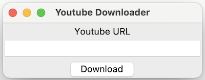

# Chapter 6: Building a Simple Desktop Youtube Downloader

In this chapter, we will be building from the user interface we've shown on chapter 5. We will be building a simple youtube video downloader using a third-party library. In this chapter, we will
exercise more on the concept of classes and objects and usage of a third-party library.

## The Interface

We will be using the user interface from the previous chapter:



And so we will also be using the code to build it:

```py
import tkinter as tk

def download():
    url = txt_url.get()
    print(url)

root = tk.Tk()
root.title('Youtube Downloader')

# Define widgets
lbl_url = tk.Label(root, text='Youtube URL')
txt_url = tk.Entry(root, width=30)
btn_download = tk.Button(root, text='Download', command=download)

# Arrange widgets using geometry manager 'pack'
lbl_url.pack()
txt_url.pack(padx=10, fill='x')
btn_download.pack(pady=5)

root.mainloop()
```

In the listing above, on line 17, we added the padding for horizontal with `padx` and the `fill='x'` to
make the entry expand horizontally when the window is resized.

Line 3-5 is a function that we will be dealing with later. For now, it just gets the content of the `txt_url` entry and
prints it to the console, but later, we will using this to add the logic for the download of the best quality video
available for the youtube video given.
