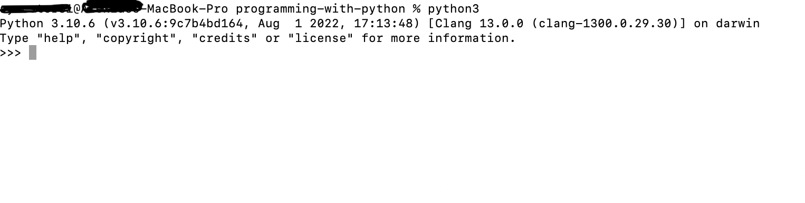

# Part I - Basic Programming Concepts


## Setting up the Development Environment

If at this point, you don't want to start setting up your development environment, there is an option. You can use 
online python interpreters. One of those is 
<a href="https://www.programiz.com/python-programming/online-compiler/">https://www.programiz.com/python-programming/online-compiler/</a>.

Now if you want to go to the path of setting up your development environment, you're going to need two things first. The python interpreter 
and a text editor. In this course, we are going to use <a href="https://code.visualstudio.com/">Visual Studio Code (VS Scode)</a> as out text editor. You can use anything you want if you have others installed but this is what we will be using in the demonstration of codes in this course. 
VS Code is also what I'll use during the online video lectures. Now make sure to install it if it's what you're going to use from the link provided above and just follow the installation prompts with the default values.

Next is to install the python interpreter from <a href="https://www.python.org/downloads/">https://www.python.org/downloads/</a>. Make sure to install the latest version of python. At the time of this writing, the latest version is {python_version}. There is only one thing to note 
and remember here during installation prompt on windows, at the first prompt, the installer will will have a checklist of installation 
parameters, one these is <strong>[  ] Include python path to environment variables</strong>, make sure to check that box as it is not checked 
by default.

If you checked the box to include python path in the environment variables and successfully installed the python interpreter and you have 
successfully installed Visual Studio Code or your editor of your choice, you are now good to go.

To ensure that python is installed on your system, open your terminal (for Unix based systems) or command prompt (for Windows users) and type 
in the command <strong>python</strong>. This should open your interactive interpreter like this one.




This is from my terminal, as you may notice, I typed in the command <strong>python3</strong>. It's because I have both python version 2 and 3
on my system. In your case, you may just enter the command <strong>python</strong>. If you seen the python version you installed, then you 
now have python interpreter working.

## Basic Syntax

## Variables and Data Types

## Type Casting

## Python Reserved Keywords

<table class="table table-striped table-bordered" style="width: 100%;">
    <tbody>
        <tr>
            <td>False</td>
            <td>def</td>
            <td>if</td>
            <td>raise</td>
        </tr>
        <tr>
            <td>None</td>
            <td>del</td>
            <td>import</td>
            <td>return</td>
        </tr>
        <tr>
            <td>True</td>
            <td>elif</td>
            <td>in</td>
            <td>try</td>
        </tr>
        <tr>
            <td>and</td>
            <td>else</td>
            <td>is</td>
            <td>while</td>
        </tr>
        <tr>
            <td>as</td>
            <td>except</td>
            <td>lambda</td>
            <td>with</td>
        </tr>
        <tr>
            <td>assert</td>
            <td>finally</td>
            <td>nonlocal</td>
            <td>yield</td>
        </tr>
        <tr>
            <td>break</td>
            <td>for</td>
            <td>not</td>
            <td>class</td>
        </tr>
        <tr>
            <td>form</td>
            <td>or</td>
            <td>continue</td>
            <td>global</td>
        </tr>
        <tr>
            <td>pass</td>
            <td></td>
            <td></td>
            <td></td>
        </tr>
    </tbody>
</table>

<p>
    Above are the reserved keywords for the Python programming language. We can use them but we cannot declare names with same name as 
    listed above.
</p>

<p>
    For example, we cannot define a variable named `global` as it is a reserved word for the language like so:
</p>

```python
global = "Assigning a string to the keyword 'global'"
```