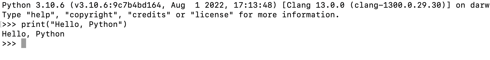
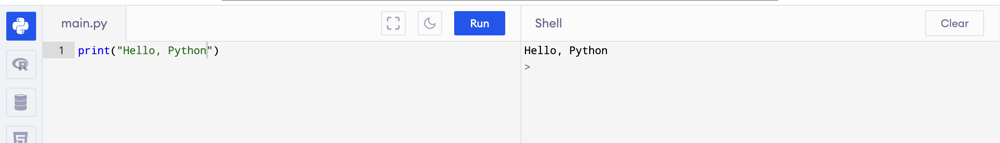
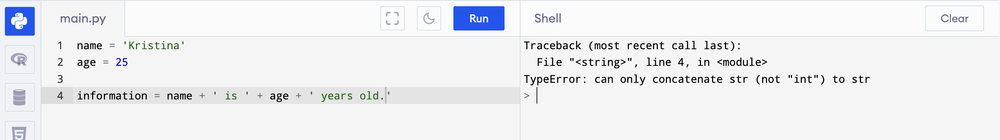
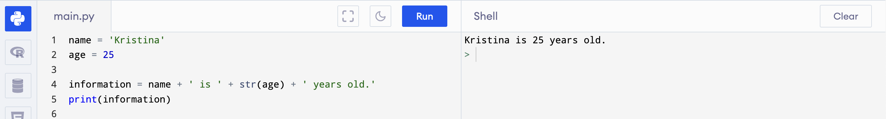

# Part I - Basic Programming Concepts


## Setting up the Development Environment

If at this point, you don't want to start setting up your development environment, there is an option. You can use 
online python interpreters. One of those is 
<a href="https://www.programiz.com/python-programming/online-compiler/">https://www.programiz.com/python-programming/online-compiler/</a>.

Now if you want to go to the path of setting up your development environment, you're going to need two things first. The python interpreter 
and a text editor. In this course, we are going to use <a href="https://code.visualstudio.com/">Visual Studio Code (VS Scode)</a> as out text editor. You can use anything you want if you have others installed but this is what we will be using in the demonstration of codes in this course. 
VS Code is also what I'll use during the online video lectures. Now make sure to install it if it's what you're going to use from the link provided above and just follow the installation prompts with the default values.

Next is to install the python interpreter from <a href="https://www.python.org/downloads/">https://www.python.org/downloads/</a>. Make sure to install the latest version of python. At the time of this writing, the latest version is {python_version}. There is only one thing to note 
and remember here during installation prompt on windows, at the first prompt, the installer will will have a checklist of installation 
parameters, one these is <strong>[  ] Include python path to environment variables</strong>, make sure to check that box as it is not checked 
by default.

If you checked the box to include python path in the environment variables and successfully installed the python interpreter and you have 
successfully installed Visual Studio Code or your editor of your choice, you are now good to go.

To ensure that python is installed on your system, open your terminal (for Unix based systems) or command prompt (for Windows users) and type 
in the command <strong>python</strong>. This should open your interactive interpreter like this one.


This is from my terminal, as you may notice, I typed in the command <strong>python3</strong>. It's because I have both python version 2 and 3
on my system. In your case, you may just enter the command <strong>python</strong>. If you seen the python version you installed, then you 
now have python interpreter working.

<br />

## Basic Syntax

Let's start with displaying something on the  screen. 

```python
print("Hello, Python!")
```

You can try to type this in the interactive python interpreter as shown and it will print on the screen `Hello, Python`.



And when using the online interpretter,



If you look on the image above, the source code is the on the left and when you clicked the **Run** button, the result of the program will be displayed on the right.

On the live session or video tutorial, I showed the creation of a source code file which will be run by a terminal command `python <filename>.py` 
where the `<filename>` is the name of the module. A **module** is a source code file with an extension of `.py`.

Please take note of these terms:

+ source code
+ module
+ terminal
+ interpreter

In the previous program, we have used a concept called **function**, and that function's name here is `print`. 

Functions are group of instructions in a programming concept. Here you can create your own functions that does something or outputs something. 
In this case, the `print` function does something and outputs something in the console/terminal. Functions are called using its name followed by 
open and close parenthesis, `print("Hello, Python")`. In this example of the function print, we passed something to it of what we called parameter.

Some functions accepts parameters, some doesn't.

In this function, we passed a literal string as parameter.

<br />

## Variables and Data Types

In python, we have various data types and they are shown below:

1. Numeric Types:  
   a. int  
   b. float  
   c. complex
   
2. Sequence Types:  
   a. list  
   b. tuple  
   c. range
   
3. Text Type:  
   a. str
   
4. Mapping Type:  
   a. dict
   
5. Set Types:  
   a. set  
   b. frozenset
   
6. Boolean Type:  
   a. bool
   
7. Binary Types:  
   a. bytes  
   b. bytearray  
   c. memoryview

In the previous example code, we have passed a Text Type or `str` for string. A string is python is a set of text or texts that is 
surrounded by quotation marks (either single or double qoutes). So the following will statements will return the same results:

```python
print("Hello, Python")
```

```python
print('Hello, Python')
```

The following are the most common data types we'll use in this course are:

- `str` - For string or texts
- `int` - For integer or whole value numbers
- `float` - For floating point values or numbers with decimal points
- `list` - For collection of different values
- `tuple` - Same as list but immutable
- `dict` - For mapping or key-value pair
- `bool` for True or False

Like other programming languages, you have to declare a variable in python before you can use them. A *variable* is a placeholder in memory 
that holds a literal value.

From the above print statement example, instead of passing the literal to the function directly, we can declare a variable that will 
hold the greeting `Hello, Python` and then pass that variable to the print function:

```py title="greeting.py" linenums="1"
# Create a variable named 'greeting'
greeting = "Hello, Python"

# Pass the variable to the print function
print(greeting)
```

After running this program, we can expect to have the same result as the previous ones. Let me discuss the code listing above. You may notice that on the left part of the code block is a list of numbers, these are line numbers. Line numbers represents the number of line of code from the 
top. Please take note that line numbers also counts the empty spaces (white spaces).

Line 1 and 4 are what we call in programming as comments. Comments are not executed by the interpreter as part of the program. They are there 
for us humans to see as reference. In the meantime while writing the code, you may say that you don't need to write comments, but you will 
appreciate it if you are already writing thousands of lines of code, after like three months, you look back at them, you'll be surprised 
that for some, you have no idea what those code does.

So some part of our codes really needs comments, not just for us, but for those who may read or maintain our codes in the future. 

They say that the best comments are those codes that are self explanatory. Meaning you don't have to put comments on them. The variables and 
function names can explain themselves. But still, comments are essential if you have something done that are not obvious why you did it.

Now let's proceed with line number 2. Here we declare a variable called `greeting`. We assign the string literal `"Hello, Python"` to it. Note 
that strings are always surrounded by quotation marks. 

<br />

### Variable Declaration

In python, you declare a variable by not stating its type like in any other language, you state its type by assigning value to it. 
The interpreter will then infer its type based on the literal value.

Lets take the following code for example:

```C title="Integer variable declaration in C"
int main() {
    int age = 25;

    return 0;
}
```

```py title="Integer variable declaration in python"
age = 25
```

Notice line 2 in the C source code and line 1 in the python source code.

Also thing to note that python is a **dynamic** language, unlike other languages such as C which are **statically typed** language. Meaning, if 
you declare a variale in C, its value type cannot be changed, unlike in python.

In the example above, we declare a variable age and assigned a value of type integer to it. After that, we can assign another value type to it 
and it will still be valid.


In the image above, we printed the type of age twice. First when we declared it as an integer, second, when we assigned a value of string to it.
Notice on the shell that it printed two different types `<class int>` and `<class str>`.

What we used here is a function named `type`. This is an example of a function that returns a string value, the type of the parameter we sent to it.

The following are sample variable assignments:

```py
name = 'Kristina'
age = 25
is_employed = True
```

<br />

## Type Casting

Type casting is a concept where in we convert a certain data type to a different ones. 

For example, a string concatenation is a concept of combining strings in programming. An example is this.

```py
first_name = 'Juan'
last_name = 'dela Cruz'

# Concatenate
full_name = first_name + ' ' + last_name
```

Here, we are combining a total of 3 strings, `first_name`, `' '` and `last_name`. The `' '` is an empty space just to make the 
full name presentable, separating the first name and last name by a space. 

Now that is okay if the objects[^1] we want to combine are all of string type. However, if we are to a add a different type to the concatenation, 
we will get an error. 



In the above example, I am trying to make the program display "Kristina is 25 years old.", but instead, the interpreter gives us an error message 
`TypeError: can only concatenate str (not "int") to str`. This tells us that we cannot combine the `age` which holds an integer to bunch of strings.

If we want to achieve it, we can use type casting to convert the integer type to a string type `str(age)`.

Another thing to note is, on the error message, it shows the line number where the error occurs. In this case, it's line 4 of our source code. 
Knowing what line on our code the error occurs saves us time in finding it.

To show you the solution, here it is:



I just used the `print` function to show the resulting concatenated string in the output.


<br/>

## Python Reserved Keywords

<table class="table table-striped table-bordered" style="width: 100%;">
    <tbody>
        <tr>
            <td>False</td>
            <td>def</td>
            <td>if</td>
            <td>raise</td>
        </tr>
        <tr>
            <td>None</td>
            <td>del</td>
            <td>import</td>
            <td>return</td>
        </tr>
        <tr>
            <td>True</td>
            <td>elif</td>
            <td>in</td>
            <td>try</td>
        </tr>
        <tr>
            <td>and</td>
            <td>else</td>
            <td>is</td>
            <td>while</td>
        </tr>
        <tr>
            <td>as</td>
            <td>except</td>
            <td>lambda</td>
            <td>with</td>
        </tr>
        <tr>
            <td>assert</td>
            <td>finally</td>
            <td>nonlocal</td>
            <td>yield</td>
        </tr>
        <tr>
            <td>break</td>
            <td>for</td>
            <td>not</td>
            <td>class</td>
        </tr>
        <tr>
            <td>form</td>
            <td>or</td>
            <td>continue</td>
            <td>global</td>
        </tr>
        <tr>
            <td>pass</td>
            <td></td>
            <td></td>
            <td></td>
        </tr>
    </tbody>
</table>

<p>
    Above are the reserved keywords for the Python programming language. We can use them but we cannot declare names with same name as 
    listed above.
</p>

<p>
    For example, we cannot define a variable named `global` as it is a reserved word for the language like so:
</p>

```python
global = "Assigning a string to the keyword 'global'"
```

You can also query the keywords inside python as shown below:


[^1]: Everything in python are objects including integers, strings, lists, dictionaries, functions, and classes.